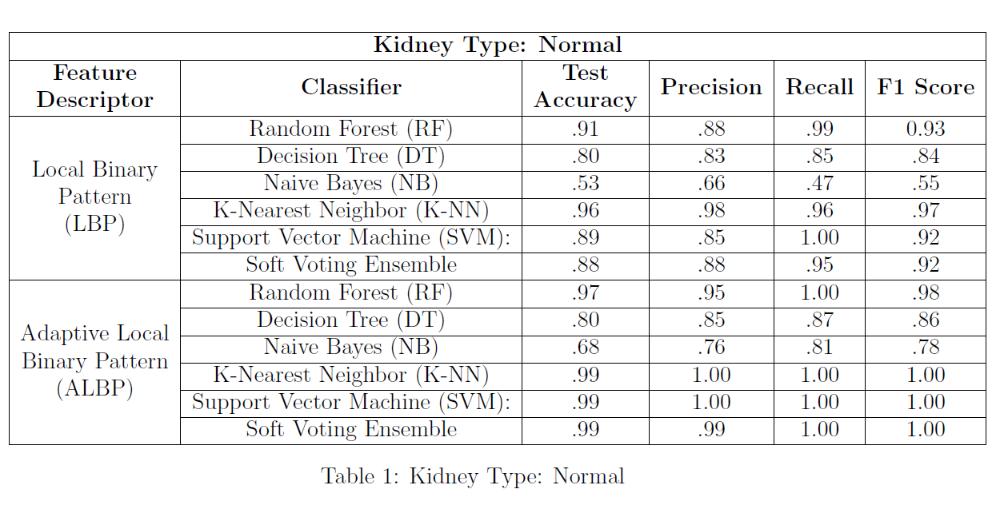
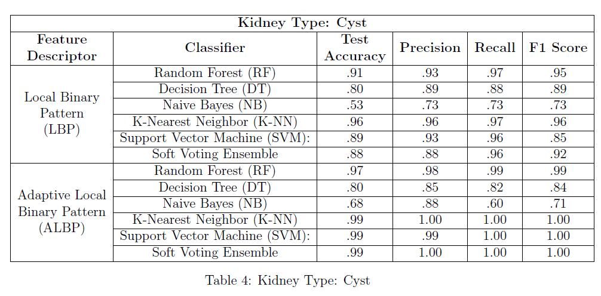

# Adaptive Local Binary Pattern: A Novel Feature Descriptor for Enhanced Analysis of Kidney Abnormalities in CT Scan Images using ensemble based Machine Learning Approach

# Overview

The shortage of nephrologists and the growing public health concern over renal failure have spurred the demand for AI systems capable of autonomously detecting kidney abnormalities. Renal failure, marked by a gradual decline in kidney function, can result from factors like cysts, stones, and tumors. Chronic kidney disease may go unnoticed initially, leading to untreated cases until they reach an advanced stage. The dataset, comprising 12,427 images from multiple hospitals in Dhaka, was categorized into four groups: cyst, tumor, stone, and normal. Our methodology aims to enhance CT scan image quality using Cropping, Resizing, and CALHE techniques, followed by feature extraction with our proposed Adaptive Local Binary Pattern (ALBP) feature extraction method compared with the state-of-the-art local binary pattern (LBP) method. Our proposed features fed into classifiers such as Random Forest, Decision Tree, Naive Bayes, K-Nearest Neighbor, and SVM. We explored an ensemble model with soft voting to get a more robust model for our task.

# Table of Content

1. Installation
2. Dataset
3. Proposed Feature Descriptor Algorithm
4. Proposed Framework
5. Usage
6. Results
7. References


# 1. Installation

1. Required Python, you can download and install from https://www.python.org/downloads/

2. Required Jupyter Notebook, you need to install by simpliy opening the command prompt / Terminal and type:

```bash
 pip install notebook
```

3. Required OpenCV (cv2), you need to install by simpliy opening the command prompt / Terminal and type:

```bash
 pip install opencv-python
```

4. Required NumPy, you need to install by simpliy opening the command prompt / Terminal and type:

```bash
 pip install numpy
```
5. Required Scikit-learn, you need to install by simpliy opening the command prompt / Terminal and type:

```bash
 pip install scikit-learn
```

6. Required Seaborn, you need to install by simpliy opening the command prompt / Terminal and type:

```bash
 pip install seaborn
```

7. Required Matplotlib, you need to install by simpliy opening the command prompt / Terminal and type:

```bash
 pip install matplotlib
```

8. If you don't want to install all the libraries you can directly run all the documents in Kaggle environment or if you want to directly install the libraries in local machine then run this command in command prompt:
```bash
 pip install -r requirements.txt
```

# Dataset

12,446 unique PACS images from different hospitals in Dhaka, Bangladesh were included in the dataset [1]. The photos showed patients with kidney tumors, cysts, normal conditions, or kidney stones. From contrast and non-contrast investigations of the whole abdomen and urogram protocols, both coronal and axial cuts were included. The DICOM data have been converted into lossless JPEG. The author of the dataset mentioned that to guarantee data accuracy, each image finding was verified by a medical technician. 3,709 photographs of cysts, 5,077 images of normal circumstances, 1,377 images of kidney stones, and 2,283 images of tumors. To download the dataset go to [Click Here](https://www.kaggle.com/datasets/nazmul0087/ct-kidney-dataset-normal-cyst-tumor-and-stone).

# Proposed Feature Descriptor Algorithm

The below figure is the algorithm of proposed feature descriptor. 


# Proposed Framework

The below figure is the proposed framework that has been used to do the test. 


# Usage

There are three folders inside this project. They are: (i) Dataset Preprocessing (ii) Proposed Feature Descriptor (iii) Model Training & Evalution. In "Model Training & Evalution" Folder there are two sub folders: (a) Adaptive Local Binary Pattern (b) Local Binary Pattern . One The explanation has given below:

### Download the Dataset

 - To download the dataset [1] go to [Click Here](https://www.kaggle.com/datasets/nazmul0087/ct-kidney-dataset-normal-cyst-tumor-and-stone).

- If you want to download the preprocessed dataset go to [Click Here](https://drive.google.com/file/d/1Q5r7aMLjA4veD4Tnh0r8LELJhNJGFnWl/view?usp=sharing).

### Data Preprocessing

In This folder we tried to used the data preprocessing by using the cropping, resizing and applied the Contrast Limited Adaptive Histogram Equalization (CLAHE) to enhance the image's contrast. Open the jupter notebook by going inside the folder and run this command in command prompt/termnial:
```bash
 jupyter notebook
```
After executing the Jupyter Notebook, it will open, allowing you to modify the dataset paths to match the location of your dataset within your local drives. You'll need to update one path for reading the dataset and another for saving the dataset after preprocessing.

### Proposed Feature Descriptor

Here we tried to compare the how the images are looking like after applying proposed Feature Descriptor (Adaptive Histogram Equalization(A-LBP)) and traditional Local Binary Pattern. Open the jupter notebook by going inside the folder and run this command in command prompt/termnial:
```bash
 jupyter notebook
```
This is just the comparision of two desciptors. From below figure it is easy to understand the difference:


### Model Training & Evalution

These notebooks contain the model training process, categorized based on the classifiers and feature descriptors utilized. Each notebook filename follows the format: "No_Feature-Extraction-Method-Name_Classifier-Name".

#### Feature Extraction Methods:
- "LBP": Local Binary Pattern
- "ALBP": Adaptive Local Binary Pattern

#### Classifiers

- "RF": Random Forest
- "DT": Decision Tree
- "NB": Gaussian Naive Bayes
- "KNN": K-Nearest-Neighbor
- "SVM": Support Vector Machine
- "ENSEMBLE": Using Soft Voting of the five classifiers to make a robust model

Each notebook contains the respective model training code for a specific combination of feature extraction method and classifier. Renaming of the files has been done according to this format to ensure clarity and ease of navigation. Open the jupter notebook by going inside the folder and run this command in command prompt/termnial:
```bash
 jupyter notebook
```
After executing the Jupyter Notebook, it will open, allowing you to modify the dataset paths to match the location of your dataset within your local drives. You can also upload the preprocessed dataset in Kaggle Environment and run there by simply uploading the notebooks. If you want to download the preprocessed dataset directly go to [Click Here](https://drive.google.com/file/d/1Q5r7aMLjA4veD4Tnh0r8LELJhNJGFnWl/view?usp=sharing).


# Results

After the benchmark we have got the below results for normal, stone, tumor and cyst types of kidney.
- For Detecting the Normal Kidney Images:

- For Detecting the Stone in Kidney Images:

- For Detecting the Tumor in Kidney Images:

- For Detecting the Cyst in Kidney Images:



# References 

[1] Md Nazmul Islam, Mehedi Hasan, Md Kabir Hossain, Md Golam Rabiul Alam, Md Zia Uddin, and Ahmet Soylu. Vision transformer and explainable transfer learning models for auto detection of kidney cyst, stone and tumor from ct-radiography. Scientific Reports, 12(1):1–14, 2022.
